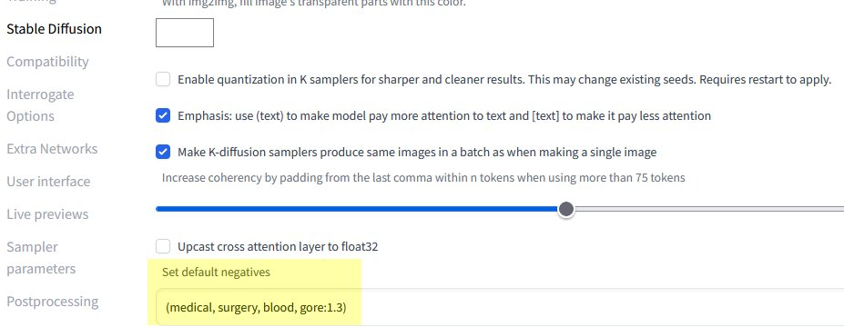

# Stable Diffusion extension: Set default negatives

A custom extension for [AUTOMATIC1111/stable-diffusion-webui](https://github.com/AUTOMATIC1111/stable-diffusion-webui) to set default negatives.

This negative prompt is silently inserted into every negative prompt and removed again, just before saving, so it doesn't clutter any file information.

## Installation

The extension can be installed directly from within the **Extensions** tab within the Webui.

You can also install it manually by running the following command from within the webui directory:

	git clone https://github.com/AlUlkesh/sd_default_negative/ extensions/sd_default_negative
